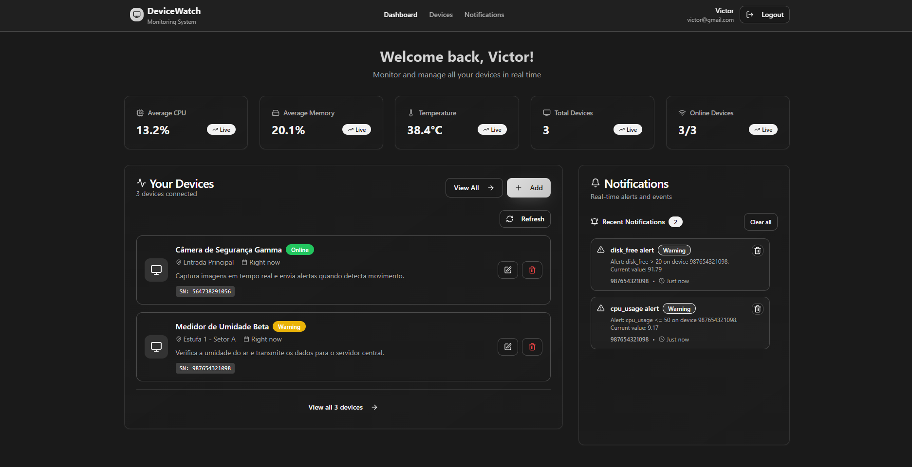
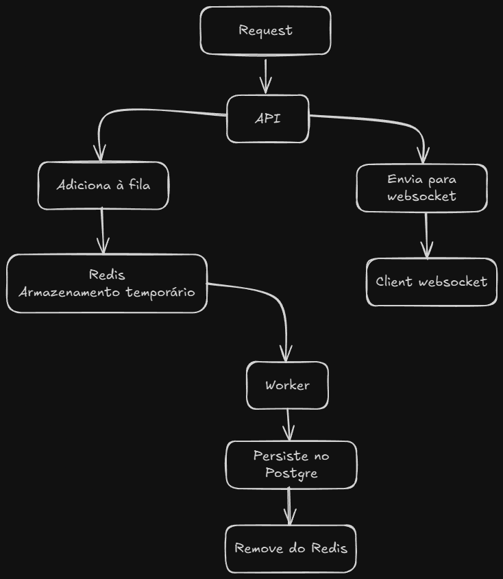

# DeviceWatch - Sistema de Monitoramento de Dispositivos

DeviceWatch é uma plataforma completa para monitoramento em tempo real de dispositivos IoT, com dashboard interativo, sistema de notificações e telemetria.

Váriaveis de ambiente estão propositalmente expostas apenas para facilitar testes!



# Índice
- [Instalação](#instalação)
- [Features](#features)
- [Back-end](#back-end)
- [Front-end](#front-end)
- [Telemetria Simulada](#telemetria-simulada)
- [Testes](#testes)

# Instalação 
O sistema roda utilizando docker, então na raiz do projeto precisa apenas utilizar o docker-compose:
```bash
docker-compose up --build
```
⚠️ Em caso de lentidão para buildar a aplicação é sugerido instalar as dependencias (npm) **ANTES** de executar o docker-compose ⚠️

```bash
cd backend && npm install
cd ..
cd frontend && npm install
```

Também é possível rodar cada container separado a partir de uma imagem ex:
```bash
cd simulator
docker build -t nome_imagem .
docker run -d --name nome_container [argumentos] nome_imagem 
```

Instalação manual back-end:
```bash
cd backend
npm install 
npm run dev
```
Ou versão de produção (Necessário adaptações):
```bash
cd backend
npm install 
npm run build
npm start
```

Instalação manual front-end:
```bash
cd frontend
npm install 
npm run build
npm start
```

Instalação manual simulador de telemetria:
```bash
cd simulator
pip install -r requirements.txt
python app.py
```
# Features
- Autenticação de Usuário com JWT
- Criptografia de senhas
- Gráficos interativos
- CRUD de Dispositivos
- CRUD de Regras de notificações
- Notificações em tempo real
- Logs de notificações

# Back-end
[](https://nodejs.org/)
[](https://www.typescriptlang.org/)
[](https://socket.io/)
[]([https://www.typescriptlang.org/](https://bullmq.io/))
[](https://expressjs.com/)
[](https://jwt.io/)
[](https://swagger.io/)
[](https://www.docker.com/)
[](https://redis.io/)
[](https://www.postgresql.org/)


Foi utilizado padrão de projeto MVC + POO como estrutura para o backend.

```
backend/
├─ db/
│  └─ init.sql        # Seeds do banco de dados
├─ src/
│  ├─ config/         # Arquivos de configurações iniciais (db, swagger, bull...)
│  ├─ controllers/    # Controllers da aplicação 
│  ├─ middlewares/    # Middlewares para validação
│  ├─ queues/         # Módulos para implementação das filas
│  ├─ repositories/   # Repositórios da aplicação 
│  ├─ routes/         # Rotas da aplicação
│  ├─ services/       # Serviços da aplicação
│  ├─ tests/          # Testes da aplicação 
│  ├─ types/          # Tipagem de dados da aplicação
│  ├─ utils/          # Utilitários
│  ├─ index.ts        # Arquivo principal de iniciação do servidor
│  └─ server.ts       # Configurações do servidor
├─ Dockerfile
└─ package.json
```

#### A documentação mais precisa sobre as rotas e suas funções estão disponíveis no **swagger**

É possível acessá-lo a partir de: `http://localhost:3000/api-docs`

#### Fluxograma dos `Heartbeats`



# Front-end
[](https://nodejs.org/)
[](https://www.typescriptlang.org/)
[](https://reactjs.org/)
[](https://www.nginx.com/)
[](https://tailwindcss.com/)
[](https://vitejs.dev/)
[](https://recharts.org/)
[](https://ui.shadcn.com/)


Estrutura utilizada no front-end:

```
frontend/
├─ src/
│ ├─ api/        # Arquivos para referência da API
│ ├─ components/ # Componentes da aplicação
│ ├─ contexts/   # Contextos da aplicação
│ ├─ hooks/      # Hooks da aplicação
│ ├─ lib/        # Utilitários
│ ├─ pages/      # Páginas
│ ├─ App.css
│ ├─ App.tsx
│ ├─ index.css
│ └─ main.tsx
├─ package.json
├─ nginx.conf     # Configuração do nginx
├─ Dockerfile
└─ package.json
```
Após o build do front-end, os arquivos da pasta `dist/` são servidos pelo **Nginx**, atuando como proxy reverso, redirecionando requisições do cliente para o servidor correto ou servindo diretamente os arquivos estáticos.

# Telemetria Simulada
[](https://www.python.org/)

O arquivo `app.py` (espera 30s para os serviços serem iniciados) é um script feito para simular telemetria para todos os devices. Ele afeta automaticamente todos os devices de todos os usuários, mandando informações aleatórias a cada um minuto.
Ele utiliza uma rota propositalmente pública apenas para simular de forma fácil e rápida qualquer dispositivo.
Sempre efetuará requisições do tipo **POST** passando como **BODY** heartbeats aleatórios.

O script também é responsável por adicionar um usuário e devices para testes de notificações, cuja a crendencial é:

- admin@admin  - *email*
- admin123     - *password*

# Testes


### Testes com jest
É possível fazer testes com o jest no back-end ex:

```bash
cd backend
npm test
```
*Isso realizará testes nos controllers da aplicação.*

### Testes de notificações em tempo real
**Espere o script iniciar.** *30s*
Faça login utilizando as credenciais fornecidas em [Telemetria Simulada](#telemetria-simulada)
Você pode visualizar as notificações no */dashboard* ou em */notifications* -> Mostra logs de notificações que já estão no banco de dados e as que estão no websocket.

### Testes em endpoints
Você pode usar o swagger para testar as rotas da api.

É possível acessá-lo a partir de `http://localhost:3000/api-docs`

